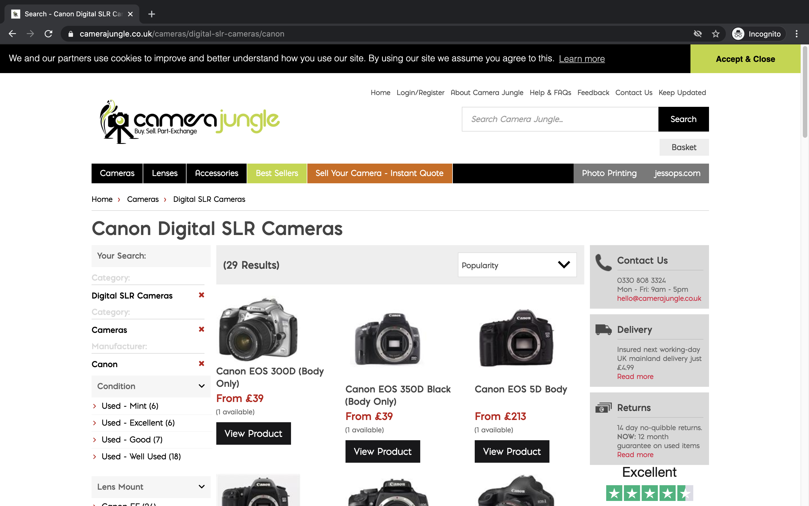
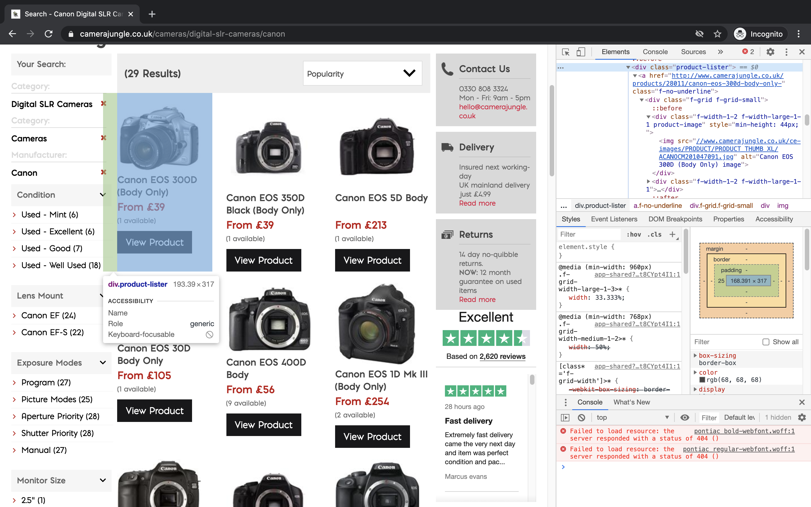
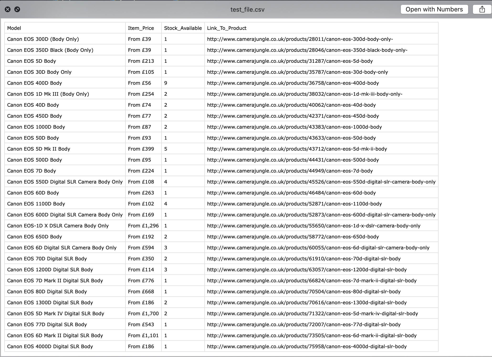

Automation and Python are two words that go great together. Let's be honest, scrolling and clicking on links are for people who pay for iCloud storage. So with that tech superior mindset we should automate data collection and export it into one place that is easy to view; enter Selenium and the CSV file. Because there is nothing better than having an Excel style spreadsheet that you can glean over and forget how to do the cell sums (we've all had to google about those things, don't lie!).

So the example I went for is a terminal application that takes a brand and searches three used camera websites, compiles the data and generates an output file. You can download and see the [source code](https://github.com/CodyAbb/camera_trawler) for the full version but let's extract the main functions and see how it works.

First, start a virtual environment (My favourite is pipenv because it makes a lock file that can be transferred between people easily):

```python
pipenv shell
pipenv install selenium
pipenv install pandas
```

Now we have to get the correct webdriver for our browser. What's a webdriver? Basically it is software controls a web browser much like a human would but without the human. Meaning we can input urls, select parts of a page, input data etc. This is really handy for test automation when working with applications on a large scale or webscraping. So this part really depends on your browser. Navigate to this [page](https://www.selenium.dev/documentation/en/getting_started_with_webdriver/browsers/) that acts as a source for each browser's supported driver. I use Chrome for its great dev tools and ability to drain your battery. Next, you need to find what version of Chrome you use. To do this on Mac:

```

Chrome > About Google Chrome

```

Which will show you what version you use (mine is 84). Next download the corresponding file and extract the executable from the zip file. There is now a few ways to do the next step including storing it as an environment variable but a simple one is to copy this file to the root of the webscraping project you just created.

Create a file and include this at the top:

```python

from selenium import webdriver

driver = webdriver.Chrome("./chromedriver", options = opts)

```

So we are importing Selenium and creating a webdriver, linking it to the Chrome driver file that is in our current directory, easy peasy.

Now let's give it a go to make sure everything is working. Add this below:

```python

driver.get(f'https://www.camerajungle.co.uk/cameras/digital-slr-cameras/canon')

```

If you run the file and a browser window opens, navigating to a camera website page, then we are all set, make sure you kill the terminal command and now let's get down to it.

First of all, we need to stop that browser opening up again and again, it will become a pain in the arse and clog Chrome to the point you have to restart it. To get around that, we can modify our code:

```python

from selenium import webdriver

#This option stops the browser from popping up
opts = webdriver.ChromeOptions()
opts.headless =True

driver = webdriver.Chrome("./chromedriver", options = opts)

```

A headless browser just means that it will run in the background without the window popping up, very handy.

So now we've come to the crux of what we came here to do, which is analyse our chosen website and to get what data we need. The first site I have chosen is Camera Jungle which is a good starting place because the website uses REST, making our URLs easy to map. Now what do I mean by this? If we navigate to Camera Jungle and pick a category like Canon DSLRs we get



We see some great things for our scraper. Firstly, all the cameras are on one page, so no having to select links to see them all. Secondly, the URL could easily get different results if the last term were changed. Perhaps using string interpolation...

Anyway, we can now examine the page to see what we need. We basically want all the cameras so we can cycle through them extracting the data right? In Chrome we can right-click on web page element and examine it.



What we are looking for is any wrapper that wraps the whole object of our product. In this case it is:

```html
<div class="product-lister"></div>
```

We could have found this element by a number of means, Class name, type of tag, XPath, lots of ways but the class makes sense here. We can now get our driver to select all the elements (aka our cameras) and assign them to a list of objects. Add this code and let's print the length of the list to make sure we have some data.

```

driver.get(f'https://www.camerajungle.co.uk/cameras/digital-slr-cameras/canon')
dslr_cameras = driver.find_elements_by_class_name('product-lister')
print(len(dslr_cameras))
driver.quit()

>>>29

```

Great, a list of 29 cameras like it say on the page. Notice the quit method at the end. This just makes sure the driver isn't left open and causes havoc with our Chrome browser. Now we have our cameras we can create a function to work through each camera picking out the data we need, printing it to terminal to make sure it works.

```python

def generate_camera_info(cameras):
            for camera in cameras:
                try:
                    model = camera.find_element_by_tag_name('h4').text
                    try:
                        price = camera.find_element_by_class_name('price').text
                    except:
                        price = "Price Not Available"
                    try:
                        stock_level = camera.find_element_by_class_name('stock').text[1]
                    except:
                        stock_level = "None Available"
                    try:
                        product_link = camera.find_element_by_tag_name('a').get_attribute('href')
                    except:
                        product_link = "Link Not Available"
                    print(model)
                    print(price)
                    print(stock_level)
                    print(product_link)
                    print('-' * 50)
                except:
                    pass

driver.get(f'https://www.camerajungle.co.uk/cameras/digital-slr-cameras/canon')
dslr_cameras = driver.find_elements_by_class_name('product-lister')

generate_camera_info(dslr_cameras)
driver.quit()

```

So what is going on here? A fancy loop. Well it takes each camera, represented by a div wrapper, and extracts one piece of data. We can break one down:

```python

price = camera.find_element_by_class_name('price').text

```

We find the price by selecting the element we want, represented by a div wrapper named 'price'. We then want the text from it, giving us "£39". We do this for all we want and then print them. The only exotic one is getting the link to the actualy product but all it does is select the href section of an anchor tag and assign that. There is not one set rule for doing this for your chosen site. But that Chrome inspect tool is your biggest ally, making it easy to select one section and have it displayed to you. The rest of the loop just accounts for if there is no data held for a specific product using error handling.

Remember I mentioned string interpolation earlier well you could try different URLs on the site and get different cameras:

```python

driver.get(f'https://www.camerajungle.co.uk/cameras/{camera_type}/{camera_brand}')

```

Exciting huh, can even be turned into a callable function with those passed in as arguments.

Now let's get CSVing. So we should make a change, instead of printing our data let's append it to some lists:

```python

model_list = []
price_list = []
stock_level_list = []
product_link_list = []

    def generate_camera_info_for_csv(cameras):
        for camera in cameras:
            try:
                model = camera.find_element_by_tag_name('h4').text
                try:
                    price = camera.find_element_by_class_name('price').text
                except:
                    price = "Price Not Available"
                try:
                    stock_level = camera.find_element_by_class_name('stock').text[1]
                except:
                    stock_level = "None Available"
                try:
                    product_link = camera.find_element_by_tag_name('a').get_attribute('href')
                except:
                    product_link = "Link Not Available"
                model_list.append(model)
                price_list.append(price)
                stock_level_list.append(stock_level)
                product_link_list.append(product_link)
            except:
                pass

```

We do this outside our function so we can give it to our next function:

```python

def create_csv(file_name):
        df = pd.DataFrame(list(zip(model_list, price_list, stock_level_list, product_link_list)), columns=['Model', 'Item_Price', 'Stock_Available', 'Link_To_Product'])
        df.to_csv(f'{file_name}.csv', index=False)

```

With two lines of code we can create a 'dataframe' (forgotten exactly what that means) with four headings matching our data and write it to a CSV file. Let me put it all together for you with the import statements at the top to make it easier to see:

```python

from selenium import webdriver
import pandas as pd

#This option stops the browser from popping up
opts = webdriver.ChromeOptions()
opts.headless =True

driver = webdriver.Chrome("./chromedriver", options = opts)

model_list = []
price_list = []
stock_level_list = []
product_link_list = []

def generate_camera_info_for_csv(cameras):
    for camera in cameras:
        try:
            model = camera.find_element_by_tag_name('h4').text
            try:
                price = camera.find_element_by_class_name('price').text
            except:
                price = "Price Not Available"
            try:
                stock_level = camera.find_element_by_class_name('stock').text[1]
            except:
                stock_level = "None Available"
            try:
                product_link = camera.find_element_by_tag_name('a').get_attribute('href')
            except:
                product_link = "Link Not Available"
            model_list.append(model)
            price_list.append(price)
            stock_level_list.append(stock_level)
            product_link_list.append(product_link)
        except:
            pass

def create_csv(file_name):
        df = pd.DataFrame(list(zip(model_list, price_list, stock_level_list, product_link_list)), columns=['Model', 'Item_Price', 'Stock_Available', 'Link_To_Product'])
        df.to_csv(f'{file_name}.csv', index=False)

driver.get(f'https://www.camerajungle.co.uk/cameras/digital-slr-cameras/canon')
dslr_cameras = driver.find_elements_by_class_name('product-lister')

generate_camera_info_for_csv(dslr_cameras)
create_csv("test_file")
driver.quit()

```

And we get:



Now the great thing about this is that it is relatively abstracted. So if you want to add another website: create a function that takes it's elements and appends them to the lists at the top. I done it with three, with different methods for hitting the correct URLs and even switching pages. As long as you take the same data or make it 'None Applicable' in the loop you can add as many sites as you want. Make the Google of used camera comparisons.

Check my [repository](https://github.com/CodyAbb/camera_trawler) for how I laid out the code and use it as a template.
