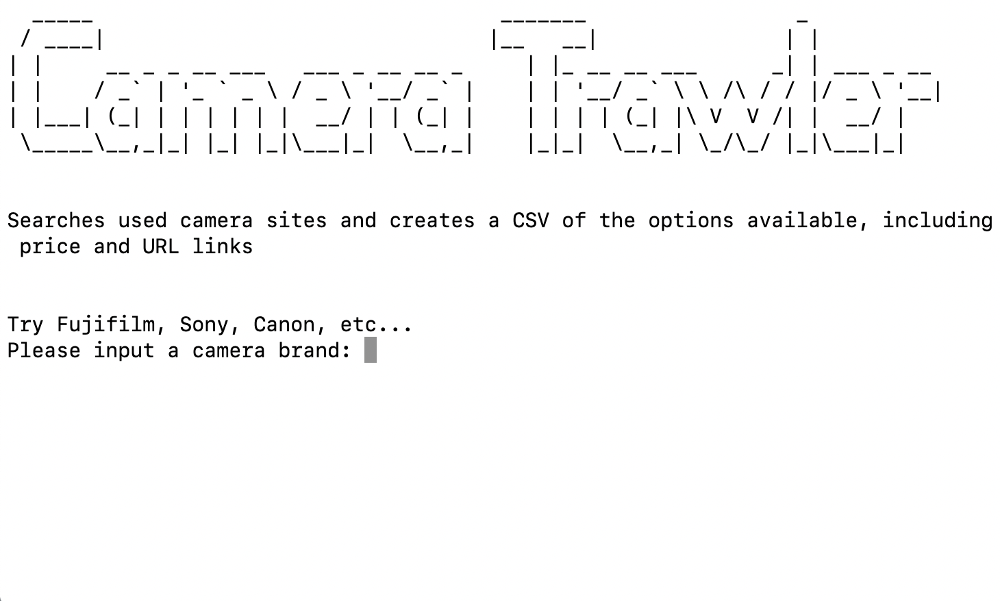

###[Repository](https://github.com/CodyAbb/camera_trawler)

I've wanted to try web scraping for a while now probably due to the geekier data tendencies I picked up studying Psychology. And by using Selenium I could justify it because of the testing skills I can implement in the future.

I have been after a camera myself for a little while so I decided to make a program that would search used camera sites and return data in a easy to read CSV file. Initially the data was only displayed in terminal but it looked a bit yuck, especially when there are over a hundred options to scroll through.

A big challenge for me was keeping the code DRY, purely because each site requires its own interaction with the webdriver to get data. This means similar looking functions that can be painful to look at it when you know about the five pillars of object-orientated programming, but needs must. Because of this, this project became a good exercise in refactoring and in the end it cleaned up not too bad. Although, I will revisit it to fix some quirks with searching for Leica cameras. It's as if for some reason websites are aware that you cannot afford them. Which is true, but it is nice to dream.

Posted on: 28 August, 2020
