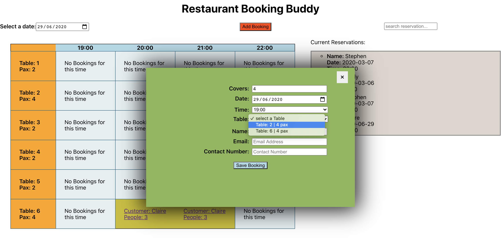

###[Repository](https://github.com/CodyAbb/restaurant-app) 
###[Hosted](https://restaurantbooker-app.herokuapp.com/)

(Note, this might take a little time to load as the back-end and front-end are on two seperate Heroku dynos)

For our final CodeClan project we created an internal table booking system for a restaurant. This project gave us a lot of freedom in how we wanted to tackle it and I feel lucky that we had someone in our group who had worked in a restaurant and enjoyed UX. She was able to provide us with a lot of direction and limit our design process to what was actually useful to someone using this system.

Our design orignally had a layout of tables that would show how many people were booked in at that point in the timeline. However, it made much more sense to have a grid that could show a period over an evening. Less aesthetically pleasing but much more practical.

In terms of tech we used the Spring framework to create our back-end. This was pretty great for mapping our relations to models and allowing Spring to take care of our SQL queries. I do enjoy Spring but because of its sheer size it can be difficult to navigate its documentation; especially when a lot of its functionality is extrapolated behind annotations. 

For the front-end we used React and were able to fit in a lot of functionality. For instance, when adding a booking the form will only show tables that are available in terms of party size, date and time. There is a search bar that will filter bookings depending on name to allow a the user to quickly double check a booking. When demonstrated I also included an email client that sends an person booking the table's contact address, just reminding them of the date and time of their booking. This is commented out in the code to stop accidental over-use but is still visible.

I think this project was the most real-world applicable of all the projects I completed at CodeClan and it helped me realise the importance of having good UX informing your decisions.

Posted on: 29 June, 2020