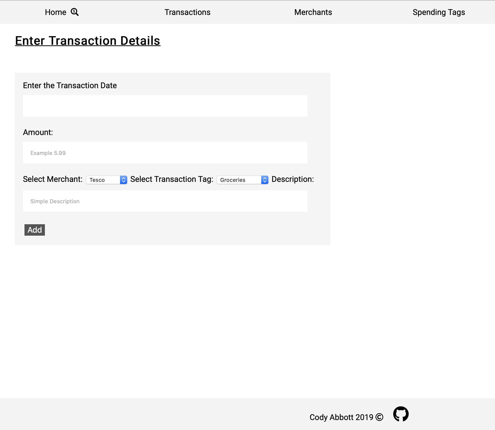
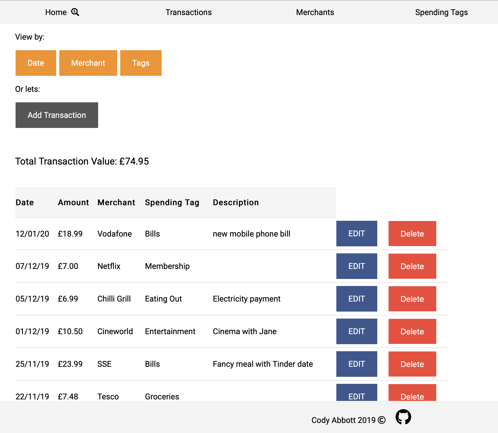

This was the first project I created at CodeClan. Built in Ruby, it uses Sinatra and Postgres Database to allow a user to track expenses from retailers they add. It is fully CRUD (allowing users to add, edit and delete their expenses) and follows RESTful routes.

Being a beginning project it is very manual by design. It follows MVC architecture with Sinatra handling the routing. Every route takes care of a specific database interaction, linking to a native SQL query (don't worry, it does account for SQL injections). In terms of front-end, it relies on ERB files for handling the dynamic content, no Rails here.

Although very manual I do believe this is the best way to start web development. Being able to trace the flow from a user's click to the interaction with the database cemented a lot of concepts that were overwhelming. It also gives you an appreciation for what frameworks extrapolate for you, especially when you can describe your models in Spring or Django and it takes care of everything!

Looking back it now, I'm quite happy with how it ended up looking, although there are a few decisions bugging me! Having to manually add every company you may want to add transaction for in a seperate page?! I also remember being happy with how the date element worked, we had not touched on any of that in the course so I challanged myself to learn how PSQL handles dates, and integrate a way to query transactions by that information.

In terms of styling it was important to me that it had some. And by that I am referrring to the fact that my earlier attempts with CSS, pre-course, had not been great. In my head I pictured something quite minimal that kept a consistent but functional design. And yes, I ripped off W3 School CSS buttons, but come on, who hasn't...

