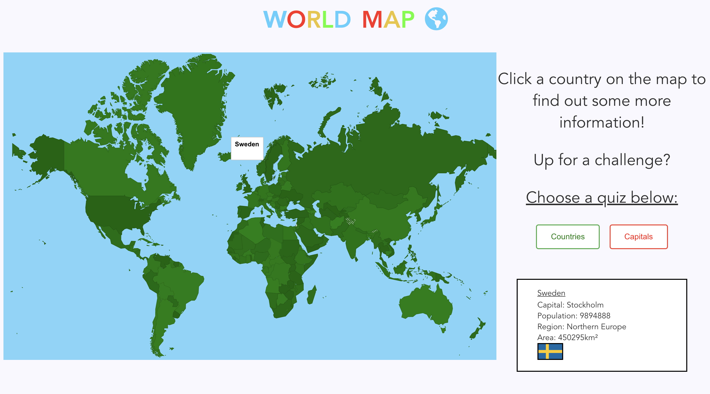
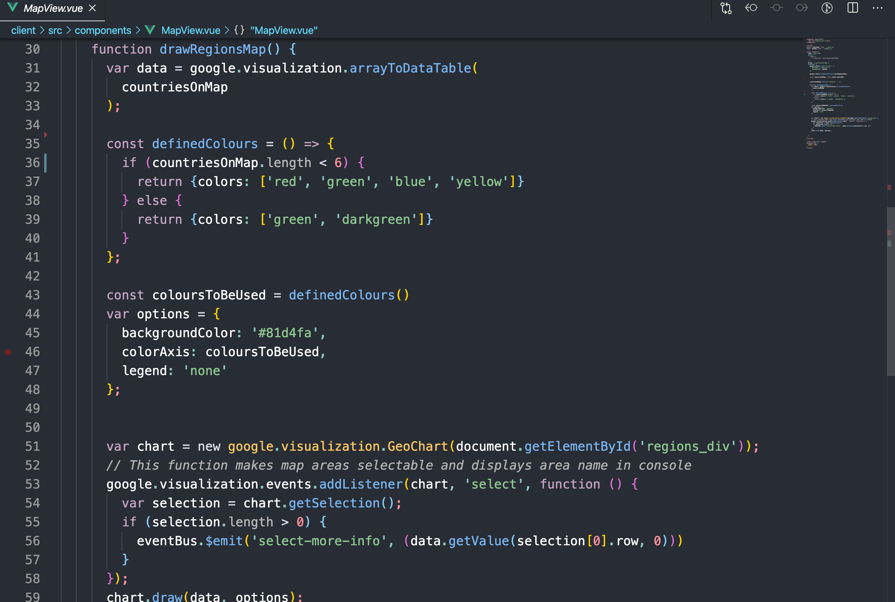

###[Repository](https://github.com/CodyAbb/world_quiz_group_project) 
###[Hosted](https://codyabb.github.io/world_quiz_group_project/)

This project tasked us with designing an interactive learning game for children. So we created an interactive map in which the user could select every country and find out some basic information about it.

When they were feeling confident they could choose to do two types of quizes. One where they were shown four random countries and a capital city, and asked to select which country had the capital city. The second displayed a flag for the country instead.

We originally hardcoded 10 questions per category in a Mongo database. Once we finished MVP however, we went back and randomly generated the questions. We also made a point of selecting countries over a certain landmass, took make it easier for those clicking on the map.

In the course this was our first time using a web framework, Vue. And at the time, everyone in the class found this to be our hardest week. We were all very confused, having trouble tracing the logic in and out of the components and the layout of files. Later on we used React and that's the framework I now have the most experience using. Looking back at Vue and contrasting it with React I feel I enjoy React more but I do see the benefits of Vue. I still believe that it is easier to trace the logic in a React project and the Vue lifecycle is hellish. However, I do like how Vue groups template, logic and styling into more defined sections. With practise I feel this would lead to cleaner code in the long run. It is also quite handy to have the eventBus, were you can push information around your project without having to include Redux.

Overall, this project ended up functioning better than expected as we came across a problem early on: Google Charts. Oh God, this thing gave us such nightmares. If you can use it exactly as Google has designed it with very little modification, it works brilliantly. For our purposes our team had to do some interesting work arounds. Even simple things due to refreshing the map, refused to work from the get go (React useEffect hook, we had not been introduced yet). But we got there in the end and it really does feel like a site you could give to a child and they could learn from. Even I learned that African countries are trickier than you would imagine.

Posted on: 17 June, 2020
